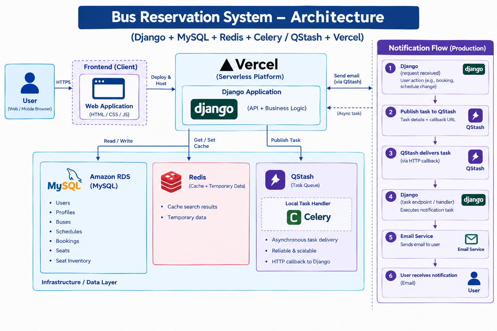

# Bus Reservation System

## Overview

 &nbsp;&nbsp;&nbsp;&nbsp;&nbsp;&nbsp;&nbsp;&nbsp;&nbsp;&nbsp;&nbsp;&nbsp;&nbsp;&nbsp;&nbsp;Bus Reservation system is a comprehensive web application which is designed to facilitate easy and efficient ticket booking and management. It aims to streamline the entire process of viewing available buses, booking tickets and cancellations. It solves the problem of manual booking of tickets where people had to visit the location to inquire about bus details and schedules which takes a lot of time.

## User Features

- User registration and authentication
- Profile management
- Search buses by source, destination, and travel date
- View bus schedules, timings, and live available seats
- Book the tickets and reserve seats
- Cancel bookings
- View booking history
- Receive schedule-change notifications

## Admin features

- Manage buses and schedules through Django Admin
- Autopopulate seat inventory when a schedule is created
- Automatic cleanup of seat inventory for completed schedules everyday using Vercel cron
- Update schedule details
- Trigger notifications for affected passengers when schedule changes

## Technologies Used

* <b>Frontend:</b> HTML, CSS, JavaScript
* <b>Backend:</b> Django, Session-based authentication, ORM, Redis, Celery, QStash
* <b>Database:</b> MySQL (Hosted on AWS RDS)
* <b>Cloud Deployment:</b> Vercel (Application), AWS (Database)

## Architecture



## Backend features

* **Concurrency Control** — pessimistic locking with select_for_update() as there is a high probability of conflicts
* **Transaction Management** — atomic booking and cancellation operations using transaction.atomic() ensuring data consistency and integrity
* **Database Query Optimization** — Eliminates N+1 query problem using select_related() by fetching related objects in a single query
* **Caching** — Redis-based caching for frequently accessed bus search results that improves response time
* **Asynchronous Processing** — Celery locally and QStash for production background tasks that improves user experience
* **Idempotency** — Redis-based idempotency keys with TTL to prevent duplicate booking requests ensuring data integrity
* **Data Integrity** — Proper database constraints and foreign-key relationships
* **Scheduled Cleanup** — Automated removal of seat inventory using Vercel cron and a protected endpoint.

## Quick Start

1. Clone the repository:

   `git clone https://github.com/sarathvadavalli/bus_reservation_system.git`
2. Navigate to the project directory and install dependencies:

```bash
   cd bus-reservation-system
   pip install -r requirements.txt
```

3. Create a **.env** file in the project root and configure environment variables as defined in *.env.example* (Ensure that .env is added to **.gitignore** to avoid committing to the repository)
4. Apply database migrations

```bash
   python manage.py migrate
```

5. Make sure Redis is running locally on `127.0.0.1:6379` or create a live Redis instance on a cloud platform like **Upstash** and specify its URL in .env

   Verify the Redis connection:

```bash
   redis-cli ping  # Expected output: PONG
```

6. Configure QStash for asynchronous task processing in the production environment and add the following credentials to your `.env` file:

```bash
 QSTASH_TOKEN, QSTASH_CURRENT_SIGNING_KEY and QSTASH_NEXT_SIGNING_KEY
```

6. Run the developement server:

```bash
   python manage.py runserver
```

The application is running at `http://127.0.0.1:8000/` and admin panel is accessible at `http://127.0.0.1:8000/admin/`

## Sample data

{
  "source": "Guntur",
  "destination": "Hyderabad",
  "date": "01-01-2027"
}

## Future Enhancements

- Personalizing customer's seat preference by asking them to choose either window or aisle seat.
- Creating an agentic workflow that could autonomously search buses and book tickets based on user's preferences and constraints.
- Integration with a payment gateway to make secure online payments for ticket bookings.
- Integration with an SMS API for booking notifications.
